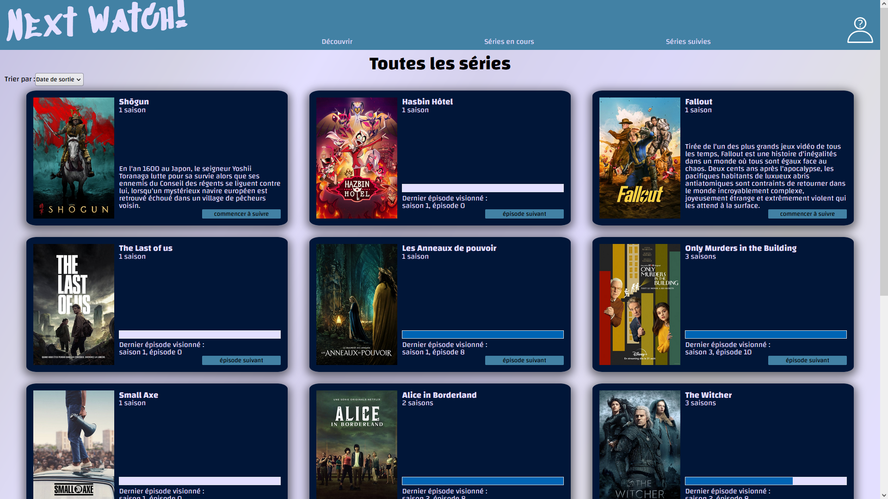

# Next Watch
## Description

Next Watch est un outil de suivi de séries TV réalisé en solo avec React. Il vous permet de garder une trace des séries que vous regardez, de déclarer les épisodes que vous avez vus et d'ajouter des séries à votre liste de suivi. Le projet vise à simplifier la gestion de votre visionnage de séries en affichant de manière claire les informations sur les séries que vous suivez.

## Fonctionnalités

* Affichage des cartes de séries TV avec les détails tels que le titre, la description et l'image de couverture
* Barre de navigation permettant de filtrer les séries affichées par état : toutes, en cours, suivies
* Possibilité de déclarer un épisode comme vu pour une série donnée
* Ajout d'un statut de suivi à une série pour indiquer si vous suivez activement la série
* Barre de progression sur les cartes des séries en cours pour indiquer votre avancement
* Tri des cartes affichées par différents critères

## Technologies Utilisées

Le projet Next Watch a été réalisé en utilisant les technologies suivantes :

* Javascript React
* HTML
* CSS

## Comment exécuter le projet localement

* Clonez ce dépôt : git clone https://github.com/votre-utilisateur/next-watch.git
* Installez les dépendances : npm install
* Démarrez l'application : npm run dev

## Auteur

Ce projet a été réalisé par Imanol Deleporte

## Capture d'écran

## Licence

Ce projet est sous licence MIT. Voir le fichier LICENSE pour plus de détails.